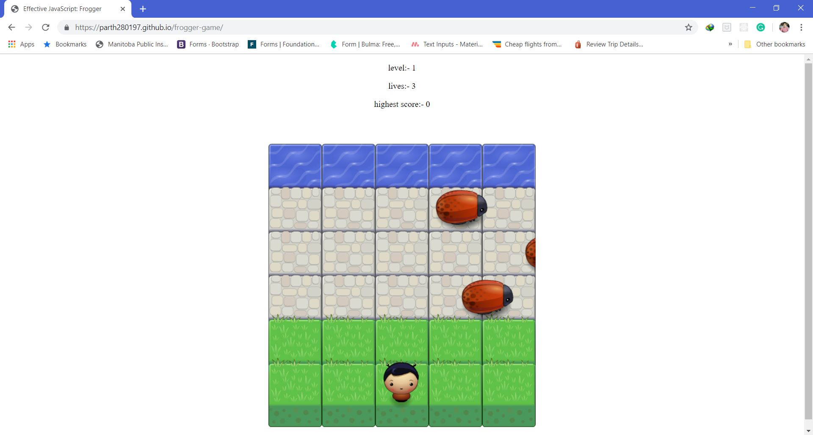

# Frogger-Game
---
## Technologies
  1. HTML
  2. CSS
  3. JS
  4. Game-Loop-Engine
## Specification
  1. Player can not move off screen
  2. Vehicles cross the screen
  3. Vehicle-player collisions happen logically (not too early or too late)
  4. Vehicle-player collision resets the game
  5. Something happens when player wins
  6. Game should show remaining lives, current level, highest score.
  7. Lives should decrease on collision of enemy and bug and on 0 lives game should reset.
  8. Current level should be increased on successful cross of player from one side to other.
  9. Highest score should be maintained through out the session.

## Implementation
  This is classic arcade game design with just HTML, CSS and JS. Here I used game loop engine and canvas to make enemy and vehicle (bugs) move smoothly.

## Screen Shots
1. Game

